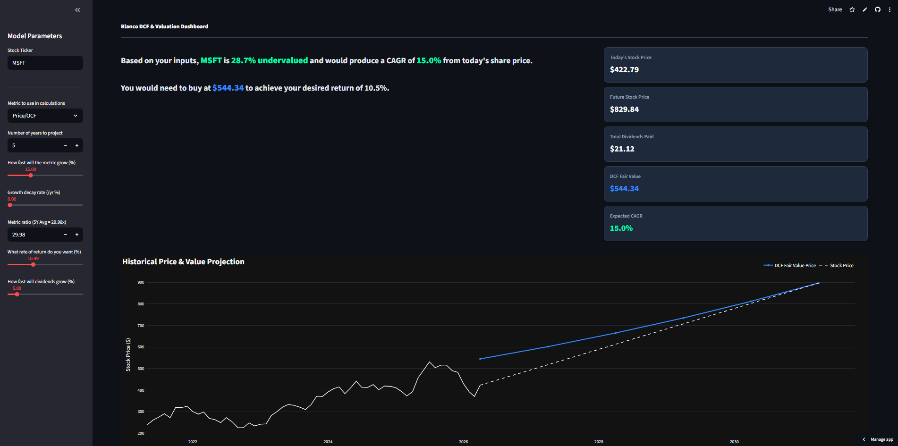
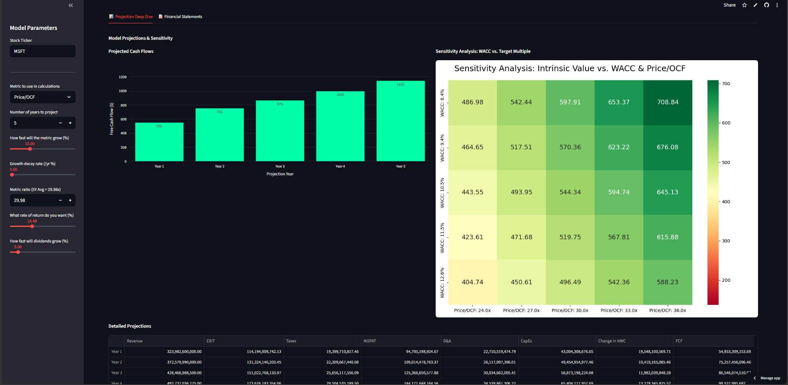

# Equity Valuation Terminal

### 🔗 [Click Here to View the Live Interactive Dashboard](https://quantamental-valuation-dashboard-5dn65gdltjkaxyqwmn4a4e.streamlit.app/)

## Overview
An automated, equity valuation terminal built in Python. This tool eliminates the "false precision" of static Excel models by dynamically pulling 10 years of historical financial data via the Yahoo Finance API to project a 5-year Base Case Discounted Cash Flow (DCF). 

It features an adaptive sensitivity matrix that stress-tests intrinsic value against Weighted Average Cost of Capital (WACC) and user-selected exit multiples (e.g., EV/EBITDA, P/E, P/OCF).

##  Dashboard Preview

## Core Features
* **Automated Financial Engineering:** Instantly extracts NWC, CapEx, D&A, and Operating Cash Flow to calculate Unlevered Free Cash Flow.
* **Dynamic WACC Calculation:** Integrates live 10-Year Treasury yields as the Risk-Free Rate alongside dynamic Beta fetching.
* **Multi-Metric Sensitivity Analysis:** A dynamic heatmap that automatically recalculates axes and target intrinsic values based on the specific valuation multiple selected by the user.
* **Total Return CAGR:** Moves beyond simple "Fair Value" to project the 5-year Compound Annual Growth Rate including expected dividend payouts.

## Technology Stack
* **Frontend:** Streamlit, Plotly Express, Plotly Graph Objects
* **Backend:** Python, Pandas, NumPy
* **Data Pipeline:** yfinance API
